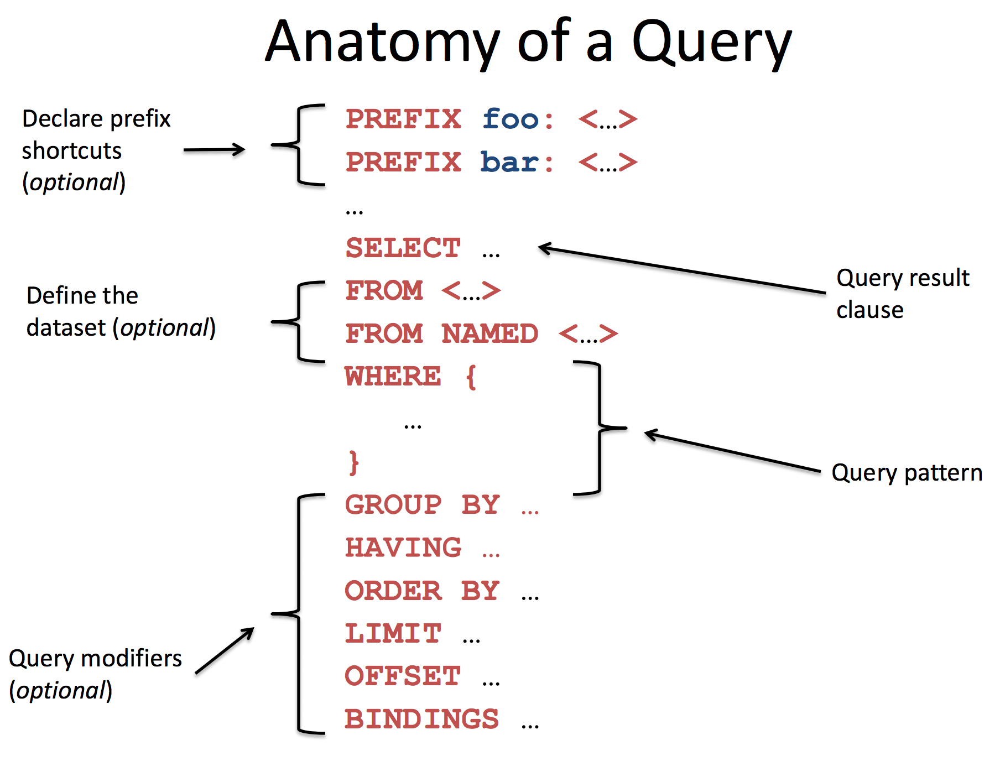
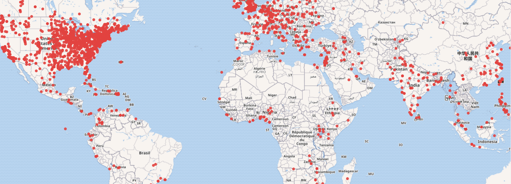
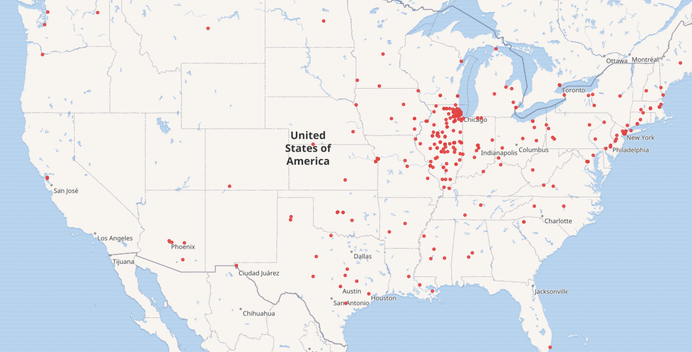
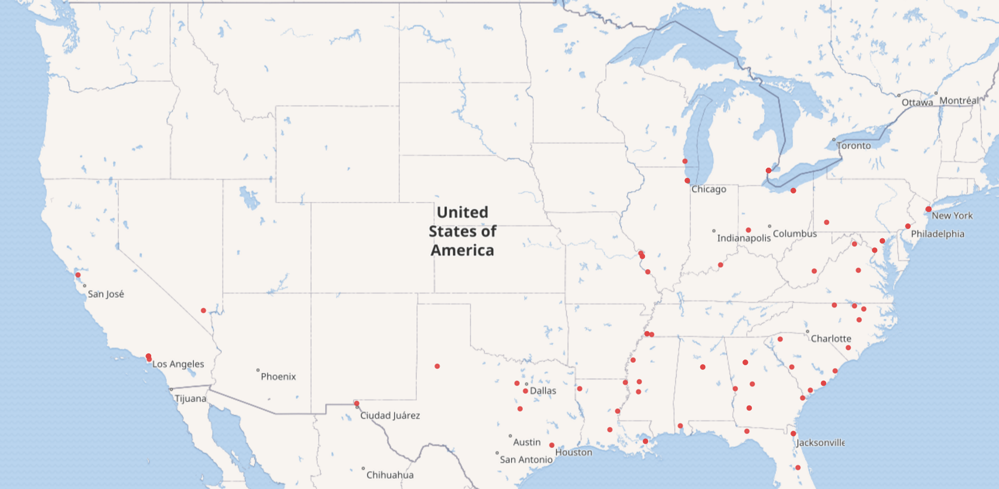
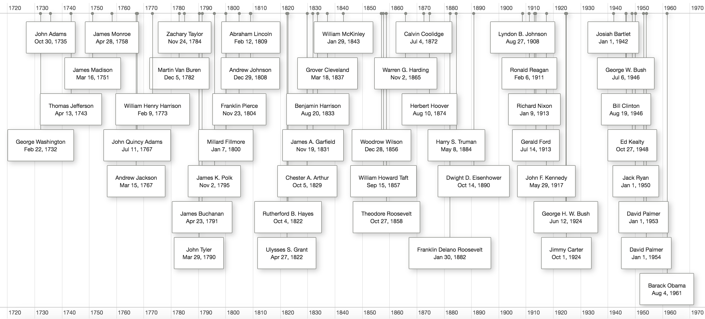
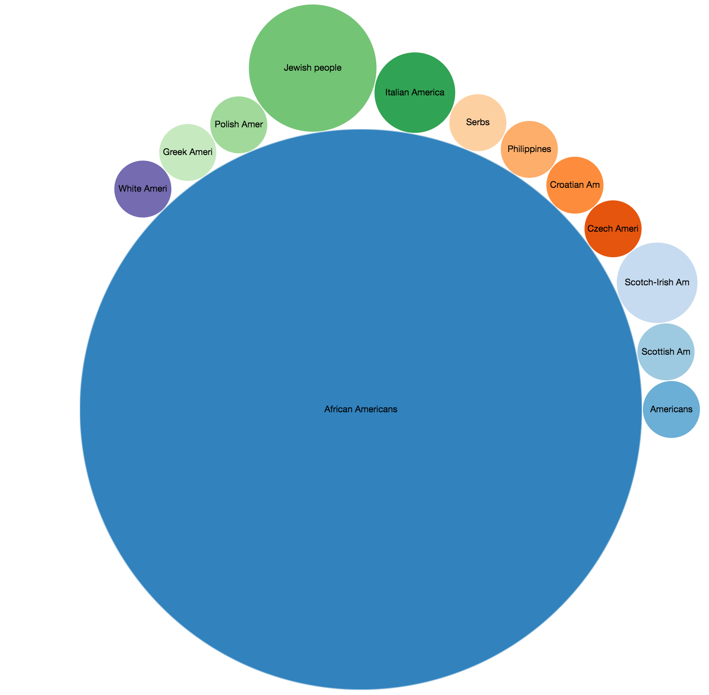

# SPARQL, made easy. 
The following two points made me create this document: 
 - **RDFs are everywhere:** a large resources like WikiData and DBPedia, based on refinement of Wikipedia, very useful for NLP research. 
 - **Documents for RDF query tools are mess:** There are a lot of information about using them spread around the web, which sometimes are erronous. I wanted something simple and handy that I can easily refer to, whenever I need to use it. 

For most this I am using the [SPARQL](https://en.wikipedia.org/wiki/SPARQL) query language. 

## Query endpoints 
There are many online tools to run your queries: 
 - DBPedia's internal SPARQL endpoint: http://dbpedia.org/sparql
 - WikiData's SPARQL endpoint: https://query.wikidata.org/
 - Bio2RDF's SPARQL endpoint: http://bio2rdf.org/sparql 

So far [YASGUI](http://yasgui.org)'s been my favorite, generic SPARQL editor, which can be used to query from a desired endpoint. 

## Basic Notation of SPARQL

### Prefixes 
The prefixes help shorten queries. In other words, instead of using full URLs, we define prefixes for them to make the call shorter. All prefix URLs/URIs that do not contain hostname are prefixed with the hostname of the generating wiki. 

Here is an exmple URI, if used directly in the script: 
```sparql 
<http://this.is.a/full/URI/written#out>
```
Instead we defined the following prefix
```sparql 
PREFIX foo: <http://this.is.a/URI/prefix#>
```
and later in the code we do: 
```sparql 
... foo:bar ... 
```

where `bar` is a concept/page/entity/etc defined on the target domain defined by `foo`. 

Often Here are the list of [prefixes for DBPedia](http://dbpedia.org/sparql?nsdecl). Also here is [a similar list of WikiData](https://www.mediawiki.org/wiki/Wikibase/Indexing/RDF_Dump_Format#Prefixes_used).  There is [this website](http://prefix.cc) to look up important global prefix names. 


### Variables
Variables are indicated by a "?" or "$" prefix. For example: 

```sparql 
?var1, ?anotherVar, ?and_one_more
```

### Comments 
You can add comments in your code, by using the `#` prefix: 
```sparql 
# This is a comment, ye ye, yo yo, ye ye ... 
```
### Literals 
 - Plain literals: `"a plain literal"`
 - Plain literal with language tag:  `“bonjour”@fr`
 - Typed literal: `"13"^^xsd:integer`
 - Some of these typed literals have shortcuts; here are some examples: 
 	- `true`  is the same as `“true”^^xsd:boolean`
	- `3`  is the same as `“3”^^xsd:integer`
	- `4.2` is the same as `“4.2”^^xsd:decimal`

Important note: SPARQL is case sensitive (because RDF is case sensitive). For example, DBpedia uses the convention that property names are start with a lower case letter (e.g. dbpedia-owl:country for "the country belonging to X is ...") and class names start with an upper case letter (e.g. dbpedia-owl:Country).
 

### Matching patterns 
These patterns are used to select sets of triples from the RDF database 

 - Match an exact RDF triple: `ex:myWidget ex:partNumber “XY24Z1” .`
 - Match one variable: `?person foaf:name “Lee Feigenbaum” .`
 - Match multiple variables: `conf:SemTech2009 ?property ?value .`

### Highlevel view of the queries 


(picture from [here](http://www.iro.umontreal.ca/~lapalme/ift6281/sparql-1_1-cheat-sheet.pdf))

Use `SELECT` defines what you want and `WHERE` defines your conditions, restrictions, and filters. 
For example: 

```sparql 
SELECT ?subject ?predicate ?object
WHERE {?subject ?predicate ?object} 
LIMIT 100
```

The `SORT` operator can be used to sort the results. The `GROUP` keyword can be used to group/cluster the results. 

```sparql  
SELECT ?predicate (COUNT(*)AS ?frequency)
WHERE {?subject ?predicate ?obDEject}
GROUP BY ?predicate
ORDER BY DESC(?frequency)
LIMIT 10
```

### Combining Results 
 - Conjunction operator `A . B`:  Join together the results of solving `A` and `B` by matching the 
 values of any variables in common.
 - Left to join `A OPTIONAL { B }`:  Join together the results of solving `A` and `B` by matching the
 values of any variables in common, if possible. Keep all solutions from A whether or
 not there’s a matching solution in `B`. 
 - Disjunction `{ A } UNION { B }`: Include both the results of solving A and the results of solving `B`.
 - Subtraction pattern `A MINUS { B }`: Solve `A`. Solve `B`. Include only those results from solving `A` 
 that are not compatible with any of the results from `B`.

## Examples:
### Getting all the people's names 
To get all the people with DBPedia: 
```sparql 
select * { ?person a dbo:Person }
limit 100
```
(try [here](http://yasgui.org/short/SkWK0IlHl))


And getting people via WikiData: 
```sparql 
SELECT ?person WHERE { ?person wdt:P31 wd:Q5 }
limit 100
```
(try [here](http://tinyurl.com/hzkj5ny))

You may wonder how to combine these results into one single call, i.e. call both DBPedia and WikiData at the same time. This is often referrd to "federated querying". In order to do so, we have to use the `SERVICE` keyword to define two end-points: 

```sparql 
PREFIX wd: <http://www.wikidata.org/entity/> 
PREFIX wdt: <http://www.wikidata.org/prop/direct/>
PREFIX dbo: <http://dbpedia.org/ontology/> 

SELECT ?person WHERE { 
  SERVICE <http://dbpedia.org/sparql> {?person a dbo:Person }
  SERVICE <https://query.wikidata.org/sparql> { ?person wdt:P31 wd:Q5 }
} LIMIT 100 
```
(try [here](http://yasgui.org/#query=PREFIX+wd%3A+%3Chttp%3A%2F%2Fwww.wikidata.org%2Fentity%2F%3E+%0APREFIX+wdt%3A+%3Chttp%3A%2F%2Fwww.wikidata.org%2Fprop%2Fdirect%2F%3E%0APREFIX+dbo%3A+%3Chttp%3A%2F%2Fdbpedia.org%2Fontology%2F%3E+%0A%0ASELECT+%3Fperson+WHERE+%7B+%0A++SERVICE+%3Chttps%3A%2F%2Fquery.wikidata.org%2Fsparql%3E+%7B+%3Fperson+wdt%3AP31+wd%3AQ5+%7D%0A++SERVICE+%3Chttp%3A%2F%2Fdbpedia.org%2Fsparql%3E+%7B%3Fperson+a+dbo%3APerson+%7D%0A%7D+LIMIT+100+%0A%0A&contentTypeConstruct=text%2Fturtle&contentTypeSelect=application%2Fsparql-results%2Bjson&endpoint=http%3A%2F%2Fabs.270a.info%2Fsparql&requestMethod=GET&tabTitle=Query&headers=%7B%7D&outputFormat=table))

### Getting all the Named-Entities that are "cats" 

```sparql
SELECT ?item ?itemLabel
WHERE
{
    ?item wdt:P31 wd:Q146 .
    SERVICE wikibase:label { bd:serviceParam wikibase:language "en" }
}
```

### Knowing that "Saint Louis University" is a "University": 

WikiData has an entry for ["Saint Louis University"](https://www.wikidata.org/wiki/Q734774) and an entry for ["University"](https://www.wikidata.org/wiki/Q3918). Given these enties (i.e. the WikiData ids), one can ask if one is [`instanceOf`](https://www.wikidata.org/wiki/Property:P31) the other one. (See the side notes at the end of this document, on how to obtain the WikiData ids) 

```sparql
ASK {
    wd:Q734774 wdt:P31* wd:Q3918
}
```
(try [here](http://tinyurl.com/jgngf68))

We can modify this to query everything that are `instanceOf` of "University" (i.e. list of universities). 
```sparql 
SELECT ?thing 
WHERE {
    ?thing wdt:P31* wd:Q3918
}
```
(try [here](http://tinyurl.com/zn3ghl5))

Or vice, get the super-types of "Saint Louis University": 

```sparql 
SELECT ?thing 
WHERE {
    wd:Q734774 wdt:P31* ?thing
}
```
(try [here](http://tinyurl.com/zu5lewf))

which are "University", "Building", "private not-for-profit educational institution". 

### City names and the countries they are in 

```sparql 
PREFIX dbo: <http://dbpedia.org/ontology/> 
SELECT DISTINCT ?city ?country 
WHERE { ?city rdf:type dbo:City ; 
              rdfs:label ?label ; 
              dbo:country ?country 
}
```
(try [here](http://yasgui.org/short/BkhTcbkHg))


### Who is Harry Potter? 

Let's say you want to describe Harry Potter. 

```sparql 
PREFIX rdf: <http://www.w3.org/1999/02/22-rdf-syntax-ns#>
PREFIX rdfs: <http://www.w3.org/2000/01/rdf-schema#>
SELECT ?type ?superType WHERE 
{ 
  # give me ?type of the resource
  <http://dbpedia.org/resource/Harry_Potter_(character)> rdf:type ?type .

  # give me ?superTypes of ?type
  OPTIONAL {
   ?type rdfs:subClassOf ?superType .
  }
}
```
(try [here](http://yasgui.org/short/Bkd9FM1Se))

which would yield results like "human", "person", "fictional character", etc. 

### Find graduates of Harward that are working at UIUC 
Similar to the previous exmples, we find the ids for properties "employer" and "educated" and ids for entities "UIUC" and "Harvard", and use the conjunction operator ".": 

```sparql 
SELECT ?person 

WHERE { 
	?person wdt:P69 wd:Q13371. 
  	?person wdt:P108 wd:Q457281
}
```
Now lets you want to get the labels for each of the triples: 

```sparql 
SELECT ?person  ?personLabel

WHERE { 
	?person wdt:P69 wd:Q13371. 
    ?person wdt:P108 wd:Q457281  
    SERVICE wikibase:label {
		bd:serviceParam wikibase:language "en" .
	}
}
```
(try [here](http://tinyurl.com/jmwseyj))

### Visualizing results on a map 
Let's continue the example of Harvard graduates by extracting their birthplace and its coordinates. Next we can use the editoro to visualize the results of the coordinates on a Map.  

```sparql
SELECT ?person  ?personLabel ?birthPlaceLabel ?coordinates

WHERE { 
	?person wdt:P69 wd:Q13371. 
  	?person wdt:P19 ?birthPlace. 
    ?birthPlace wdt:P625 ?coordinates .
    SERVICE wikibase:label {
		bd:serviceParam wikibase:language "en" .
	}
}
```
(run [here](http://tinyurl.com/z8434u4))



As you can see, most the Hardvard graduates are from east coast, USA. While west of China or central Africal almost have no representatives. 
Repeating [the same thing for UIUC graduates](http://tinyurl.com/hshxhpv) would show that most UIUC gradutes are coming from MidWest, USA, and mostly from Chicago suburbs:  



### Birth place of African-American house representatives during history 

```sparql 
SELECT ?personLabel ?coordinates

WHERE { 
    ?person wdt:P39 wd:Q13218630 . 
    ?person wdt:P172 wd:Q49085 . 
    ?person wdt:P19 ?birthPlace. 
    ?birthPlace wdt:P625 ?coordinates .
  	
    SERVICE wikibase:label {
        bd:serviceParam wikibase:language "en" .
    }
} 
```
(try [here](http://tinyurl.com/j6cvlb3))



### Visualizing timeline 
The SPARQL editor of WikiData also has ability to visualize data as timeline.
Here I am visualizing the US presidents according to their date of birth. (try [here](http://tinyurl.com/zwtqv4r))



### Distribution of members of house of representatives based on their ethnicity 

```sparql
SELECT ?ethLabel (COUNT(*) as  ?count)

WHERE { 
    ?person wdt:P39 wd:Q13218630 . 
    ?person wdt:P172 ?eth . 
  	
    SERVICE wikibase:label {
        bd:serviceParam wikibase:language "en" .
    }
} GROUP BY ?ethLabel
```



This is slightly misleading, since as we all know the majority is not African-Americans, but rather among the ones that have "ethnicity" label. In order to add an extra category for the ones that do no have an explicit ethnicity, we can use the `OPTIONAL` keyword to define it as optional.

```sparql
SELECT ?ethLabel (COUNT(*) as  ?count)

WHERE { 
    ?person wdt:P39 wd:Q13218630 . 
    OPTIONAL { ?person wdt:P172 ?eth }. 
  	
    SERVICE wikibase:label {
        bd:serviceParam wikibase:language "en" .
    }
} GROUP BY ?ethLabel
```

which would result in 10806 representatives without ethnicity label. 


### Finding distance between two nodes 

Essentially finding the shortest common ancestor of A and B (idea from [here](http://stackoverflow.com/questions/19680440/finding-common-superclass-and-length-of-path-in-class-hierarchies/19681697#19681697))

DBPedia

```sparql
SELECT ?a ?b ?super (?aLength + ?bLength as ?length)
{
  values (?a ?b) { (dbo:Person dbo:SportsTeam) }
  { 
    SELECT ?a ?super (COUNT(?mid) as ?aLength) { 
      ?a rdfs:subClassOf* ?mid .
      ?mid rdfs:subClassOf+ ?super .
    }
    GROUP BY ?a ?super
  }
  { 
    SELECT ?b ?super (COUNT(?mid) as ?bLength) { 
      ?b rdfs:subClassOf* ?mid .
      ?mid rdfs:subClassOf+ ?super .
    }
    GROUP BY ?b ?super
  }
}
ORDER BY ?length
LIMIT 1
```
(try [here](http://yasgui.org/short/HJWAUDgBl))


WikiData 

```sparql
SELECT ?a ?b ?super (?aLength + ?bLength as ?length)
{
  values (?a ?b) { (wd:Q5 wd:Q349) }
  { 
    SELECT ?a ?super (COUNT(?mid) as ?aLength) { 
      ?a wdt:P279* ?mid .
      ?mid wdt:P279+ ?super .
    }
    GROUP BY ?a ?super
  }
  { 
    SELECT ?b ?super (COUNT(?mid) as ?bLength) { 
      ?b wdt:P279* ?mid .
      ?mid wdt:P279+ ?super .
    }
    GROUP BY ?b ?super
  }
}
ORDER BY ?length
LIMIT 1
```
(try [here](http://tinyurl.com/gnq8ts5))

## How to use the results in your code? 
There a bunch of libraries that are intended for this; for example: 
 - [`SPARQLConnection` of RDF4J](http://docs.rdf4j.org/javadoc/1.0/index.html?org/eclipse/rdf4j/repository/sparql/SPARQLConnection.html)
 - [Jena Query Builder](https://jena.apache.org/documentation/extras/querybuilder/)
 
But my preferred way of using the result is using the POST/GET apis provided by many endpoints. For example, here is a GET api for Wikidata which provides json results: 

 - WikiData: `https://query.wikidata.org/sparql?format=json&query=PUT-YOUR-QUERY-HERE` for example [this](https://query.wikidata.org/sparql?format=json&query=ASK%20{%20wd:Q734774%20wdt:P31*%20wd:Q3918%20}). 
 - DBPedia: `https://dbpedia.org/sparql?format=json&default-graph-uri=PUT-YOUR-QUERY-HERE` for example [this](https://dbpedia.org/sparql?format=json&default-graph-uri=http%3A%2F%2Fdbpedia.org&query=select+distinct+%3FConcept+where+%7B%5B%5D+a+%3FConcept%7D+LIMIT+100).

## Side notes
- You can use Wikipedia API to map Wiki page titles to WikiData ids. For example [here is the mapping for "Universityr", returned as JSON](https://en.wikipedia.org/w/api.php?action=query&prop=pageprops&format=json&titles=University). 


## Further reading
 - A comprehensive [cheatsheet](http://www.iro.umontreal.ca/~lapalme/ift6281/sparql-1_1-cheat-sheet.pdf). 
 - General [syntax guidelines](https://wiki.base22.com/display/btg/SPARQL+Query+Examples#SPARQLQueryExamples-Findallclasseswithagivenprefix). 
 - A list of [WikiData exmaples](https://www.wikidata.org/wiki/Wikidata:SPARQL_query_service/queries/examples). 
